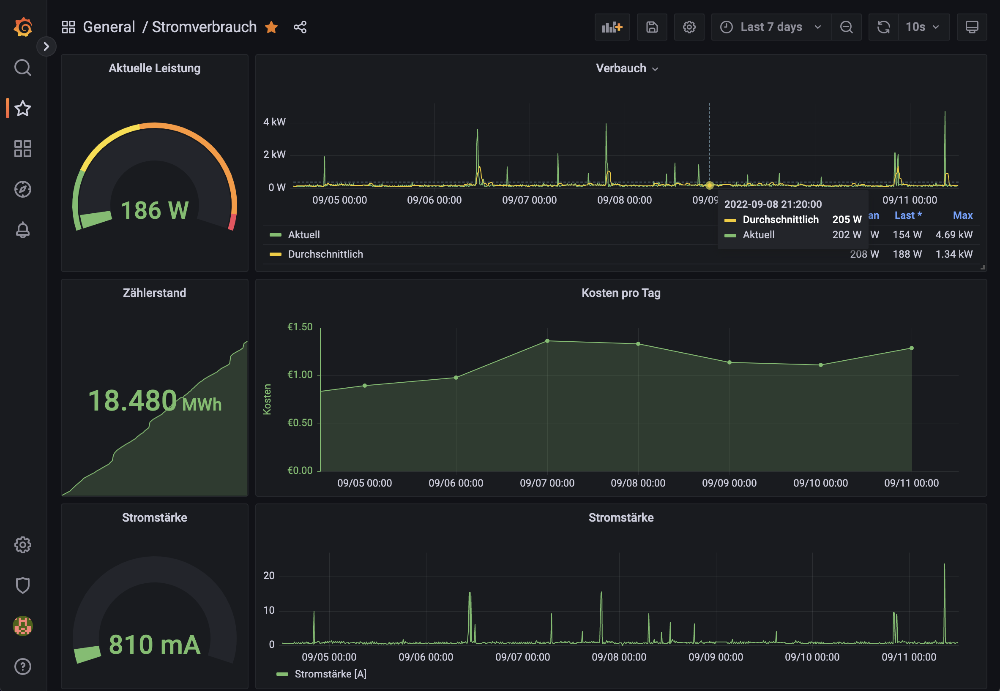
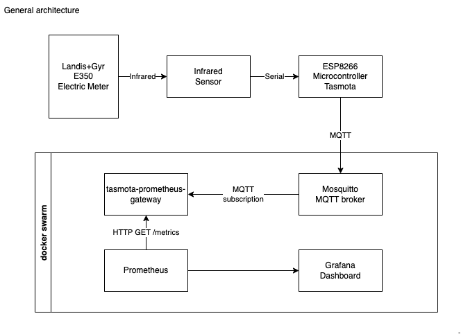

# mqtt-prometheus-gateway

A gateway listening on MQTT packets to obtain information from sensors and publish it as a prometheus metric.

## My setup

Some years ago, my electricity provider installed a new electric meter (Landis+Gyr E350) whose data can be accessed via an infrared interface. I always wanted to know more about my electric consumption, so I was thrilled when a colleague gave me a few surplus pieces to do just that. It was an infrared sensor and a ESP 8266 microcontroller. The microcontroller, equipped with the [Tasmota Firmware](https://github.com/arendst/tasmota), is capable to access the sensor over its serial interface, talk the meter language and send the data via MQTT protocol to a broker.

I use a [Mosquitto](https://mosquitto.org/) message broker, [Prometheus](https://prometheus.io/docs/introduction/overview/) and [Grafana](https://grafana.com/) to make this data visible. The only missing link is to get the data from the broker to Prometheus, and so I created this little utility.

In the meantime, I've added a gas meter sensor, which also uses a ESP8266, but a reed relay to measure the turns of the meter's wheel. So I expanded the tool to be more configurable which MQTT topics to subscribe and to which Prometheus metrics to publish the data. Also, I've added a HY001 temperature sensor which measures the outside temperature.

## Configuration

Configuration is made in a `config.yaml` file.
Settings starting with `MQTT_` and `HTTP_` can also be overwritten via environment variables, e.g. with an `.env` file.
A sample of such an `.env` file is provides as `.env.sample`.
You can use that as a starting point by copying/renaming it to `.env` or `.env.local`.

The configuration of MQTT topic subscriptions and the mapping of topic data to Prometheus metrics provided in the delivered `config.yaml` contains my own settings and can be adapted as you need it.

The file is formatted as YAML, containing only one entry "metrics" which contains a list of mappings. Each mapping has the following fields:

- **name**: Prometheus metrics name
- **description**: A description what the metrics value means. This is shown in Prometheus
- **type**: The [Prometheus metrics type](https://prometheus.io/docs/concepts/metric_types/)
- **topic**: The MQTT topic path to subscribe to (may be used for multiple metrics)
- **path**: Path to single value in MQTT topic
- **labels**: Labels to add to the Prometheus metric. These are also key / path pairs, with the path being the source of the actual value in the MQTT topic

## Run a complete setup in docker

Mosquitto, Prometheus, Grafana and the mqtt-prometheus-gateway tool are run in a docker environment. You can find a [docker compose file here](./docker-compose.yaml). It uses some configuration files I've included here as a starting point.

To run this, you need NodeJS >= version 18. Install dependencies, and run the docker compose file:

    npm install
    docker compose up

You can find [my Grafana dashboard here](./grafana/dashboard.json).

## Run the gateway locally

To use only the gateway utility itself locally, you need NodeJS >= version 18.

Clone the repository and install the dependencies:

    git clone https://github.com/jschirrmacher/mqtt-prometheus-gateway.git
    cd mqtt-prometheus-gateway
    npm install

Next, copy the `.env.template` file to `.env.local` and edit this new file to match your needs.
Then, start the program:

    npm start

## Metrics endpoint

Metrics are served under <http://localhost:PORT/metrics> with the PORT from the `.env` file.
